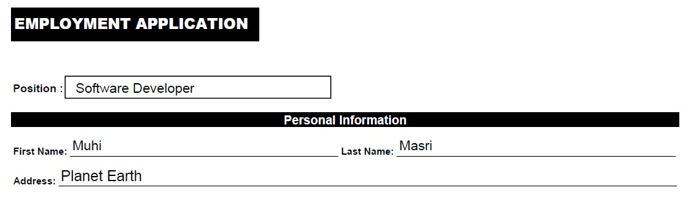

# AWS Textract App

Extracts Text from an image and shows the result using Amazon Textract and NodeJS.

# Usage:

Clone repository, npm install and use image below for testing. You also need to create your own .env file with the required AWS configurations.

